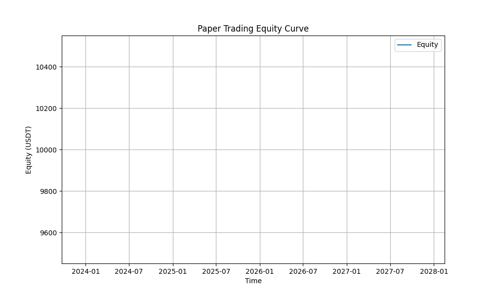

# Crypto AI Decision System 🤖📈

An advanced, AI-powered crypto trading bot featuring regime detection, strict risk management, and a safety guardian.

## 🚀 Features
-   **AI Regime Detection**: Uses XGBoost/LSTM to classify market regimes (Bull/Bear/Sideways).
-   **Risk Engine**: Enforces strict capital preservation (1.5% SL, 1% Risk, 1.0x Leverage).
-   **Guardian Service**: A separate daemon that monitors system health, exposure, and PnL, with an active Kill-Switch.
-   **Live Execution**: Async execution queue with `ccxt` for Binance Futures (Testnet & Mainnet).
-   **Reporting**: Automated generation of execution reports and equity curves.

## 📂 Reports & Audits
We maintain rigorous audit logs and performance reports:
-   [Go-Live Readiness Report (98/100)](reports/go_live_readiness_report.md) ✅
-   [Paper Trading Report](reports/paper_trading_report.md) 📄
-   [Compliance Audit](reports/compliance_audit_report.md) 🛡️
-   [Operational Audit](reports/operational_audit_report.md) ⚙️
-   [Project Completion Report](reports/project_completion_report.md) 🏁
-   

## 🛠️ Installation
```bash
# Clone the repo
git clone https://github.com/Himanish-18/crypto-ai-decision-system.git
cd crypto-ai-decision-system

# Install dependencies
python3 -m venv venv
source venv/bin/activate
pip install -r requirements.txt
```

## 🚦 Usage

### 1. Paper Trading (Dry-Run)
The bot runs in dry-run mode by default if no API keys are present.
```bash
./run_bot.sh
```

### 2. Live Trading (Mainnet)
**WARNING**: Real money involved. Read [Deployment Guide](README_DEPLOYMENT.md) first.
1.  Create `.env` with `BINANCE_API_KEY`, `BINANCE_SECRET_KEY`, and `GO_LIVE=true`.
2.  Run via systemd or nohup.

### 3. Dashboard
Monitor live performance:
```bash
streamlit run src/app/monitor_dashboard.py
```

## 📜 Deployment
For detailed deployment instructions, including `systemd` configuration and recovery steps, see [README_DEPLOYMENT.md](README_DEPLOYMENT.md).

## 🛡️ Safety Mechanisms
-   **Kill-Switch**: Locks account after 3 consecutive losses.
-   **Daily Drawdown Limit**: Stops trading if daily loss > 2%.
-   **Exposure Limit**: Max 5% of equity allocated.
