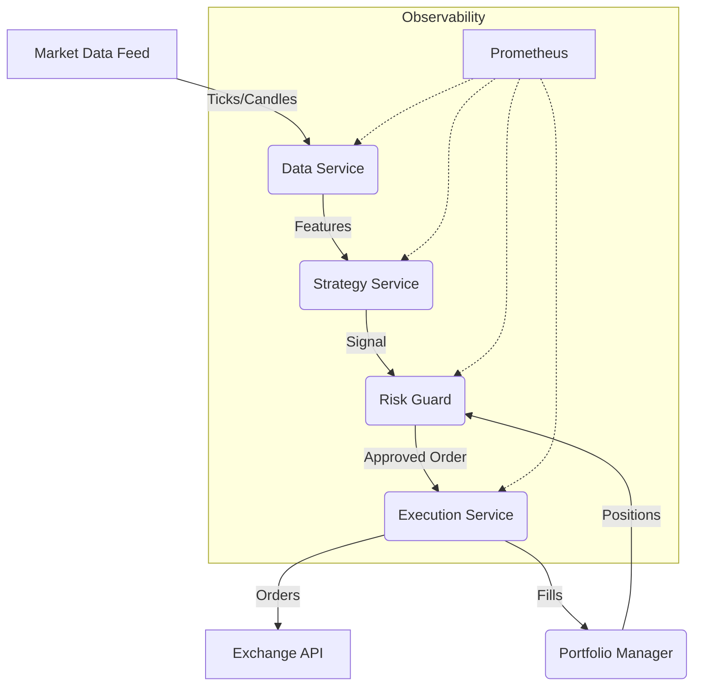

# Architecture - Institutional Core v25

## System Overview

The v25 system is built on an event-driven microservices architecture to ensure decoupling, scalability, and robustness.

### High-Level Components

### Module Breakdown

#### 1. Data Service
Responsible for normalizing raw data from multiple exchanges and computing real-time features.
- **Inputs**: Websocket feeds, REST polling.
- **Outputs**: Feature matrix (X).

#### 2. Strategy Service
Hosts the ML models (Ensemble of LightGBM, LSTM, RL).
- **Core**: `MetaModel` with regime-switching logic.
- **Validation**: Real-time drift detection.

#### 3. Risk Guard
The gatekeeper. No order passes without approval.
- **Checks**: Max Leverage, Max Drawdown, cVaR limit.

#### 4. Execution Service
Executes parent orders using child algorithms.
- **Strategies**: TWAP, VWAP.
- **Optimization**: Minimizes implementation shortfall using Microprice.

### Data Flow

1. **Ingest**: Raw data lands in `Data Service`.
2. **Transform**: Features are computed and versioned.
3. **Predict**: `Strategy Service` generates target position.
4. **Vet**: `Risk Service` validates safety.
5. **Execute**: `Execution Service` slices the order.
6. **Monitor**: `Observability` tracks latency and drift.
